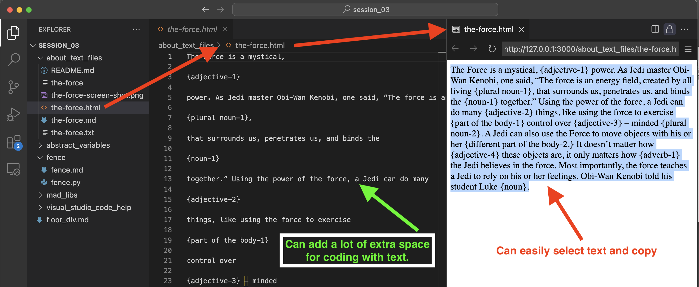

# Text files

_Presented in a somewhat logical progression_
## pixels: 

`the-force-screen-shot.png` 

Contains no readable characters. May be converted by Optical Character Recognition (OCR). Or you can vocalize the text into your smart phone app and use text-to-speech recognition to get a text file with characters.

VS code will present the .png file in the Code area.

## No file extension: 

`the-force` 

Perfectly okay for command line. This is considered a text file even though it does not have a `.txt` extension.  There is no requirement for extensions to view a file on LINUX systems.

## Text file (.txt):
 `the-force.txt` simple text, baically the same as the no extension file, but can be opened by apps like Microsoft Word

## Markdown: 

`the-force.md`

## HTML

Simply adding an `.html` extension will not make this a valid HTML file, but the text will be presented in a browser with exta spaces removed. (except one space between words). This can be a very quick way to process raw text quickly so that all of the extra spaces are removed. Installing live preview in Visual Studio Code makes it so you don't have to open a browser.

